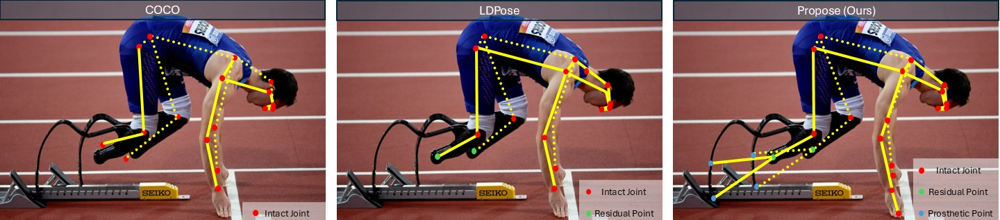
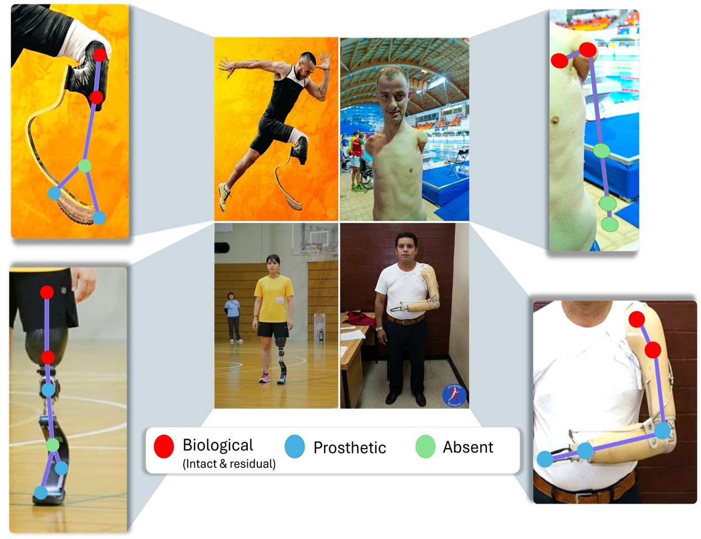
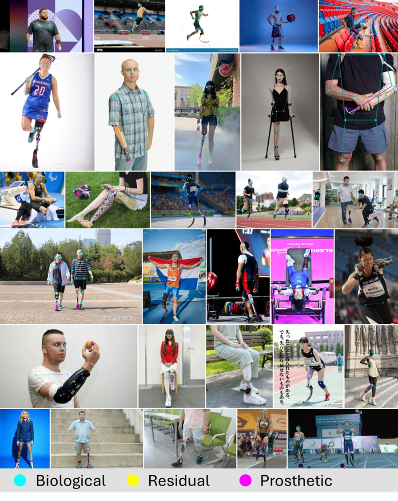
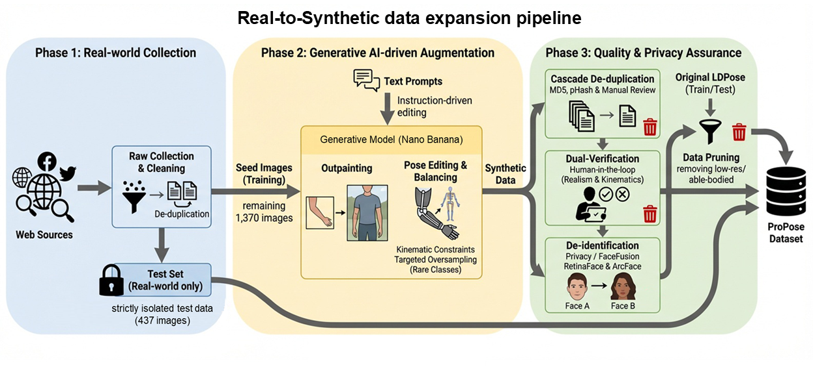
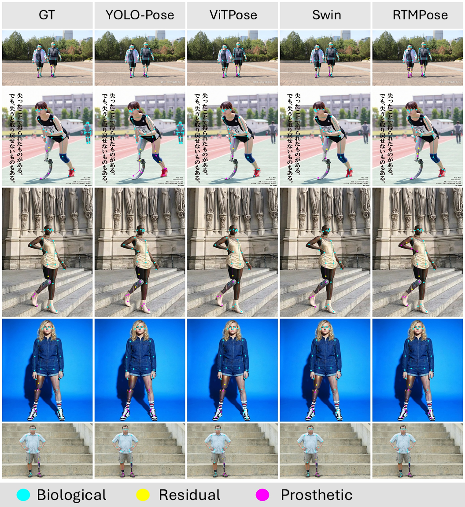

# ProPose

<p align="center">
  
</p>

Official implementation for **ProPose: Topology-Unified 2D Pose Estimation across Intact, Residual and Prosthetic Limbs**.

ProPose introduces a topology-unified 2D human pose estimation benchmark and learning framework for humans with intact, residual, and prosthetic limbs. This repository is built upon [MMPose](https://github.com/open-mmlab/mmpose), with modifications for the Omni-Pose annotation protocol, ProPose dataset loading, semantic keypoint type prediction, Pro-Loss, and evaluation metrics.

> **Note:** This codebase is modified from MMPose. We thank the MMPose contributors for their excellent open-source toolbox.

---

## Overview

ProPose aims to address topology mismatch and representation bias in existing human pose estimation datasets. Unlike standard pose estimation protocols that assume able-bodied human topology, ProPose explicitly models biological, prosthetic, and physically absent keypoints within a unified representation.

<p align="center">
  
</p>

---

## Omni-Pose Protocol

The proposed **Omni-Pose** protocol unifies pose representation across intact, residual, and prosthetic limbs. Each keypoint is associated with both spatial coordinates and a semantic type:

- `Bio`: biological keypoint;
- `Pros`: prosthetic keypoint;
- `Abs`: physically absent keypoint.

<p align="center">
  
</p>

---

## Dataset Construction

ProPose is constructed through real-world data collection, generative data expansion, quality filtering, and expert annotation. To alleviate the long-tail distribution of prosthetic keypoints, we design a Real-to-Synthetic data expansion pipeline.

<p align="center">
  
</p>

Examples of the Real-to-Synthetic data expansion process are shown below.

<p align="center">
  
</p>

---

## Qualitative Results

Qualitative comparisons show that models trained with ProPose and Pro-Loss can better handle intact, residual, and prosthetic limbs.

<p align="center">
  
</p>

---

## Installation

This repository is based on MMPose.


### Setup

```bash
conda create -n propose python=3.10 -y
conda activate propose

# Install PyTorch according to your CUDA version.
# The following versions are used in our tested environment.
pip install torch==2.9.0+cu130 torchvision==0.24.0+cu130 torchaudio==2.9.0+cu130 --index-url https://download.pytorch.org/whl/cu130

# Install OpenMMLab dependencies.
pip install openmim==0.3.9
mim install mmengine==0.10.7
mim install mmcv==2.1.0
mim install mmdet==3.2.0

# Install additional dependencies.
pip install numpy==2.2.6 opencv-python==4.10.0.84 pycocotools==2.0.11 xtcocotools==1.14.3
```

If the exact CUDA 13.0 PyTorch wheel is unavailable on your system, please install the PyTorch version that matches your CUDA driver from the official PyTorch installation instructions, while keeping the OpenMMLab package versions consistent with the tested environment above.
